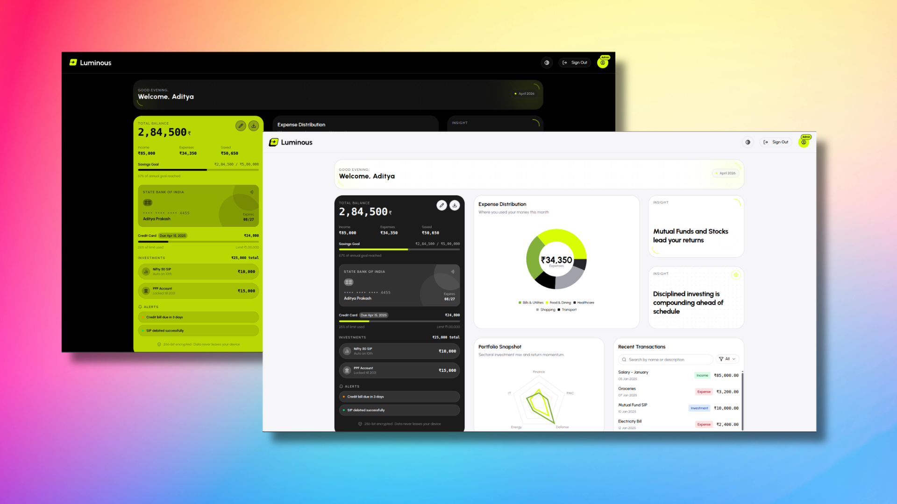
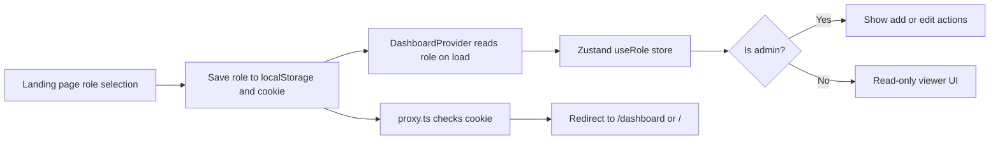

# Luminous



> _Check out assets folder for more image of this project._

## Project Overview

Luminous is a modern finance dashboard built with Next.js that helps users explore overall financial summary data, transaction activity, spending patterns, and simple insights in a clean interface.

The app is designed as a frontend demonstration of a personal finance experience. It includes summary cards, chart-based visualization, a searchable transactions section, simulated roles, and a set of insights that make the data easier to understand at a glance.

## Demo Video

[Watch the Luminous Demo](https://github.com/user-attachments/assets/0b96e4ae-a021-425a-a638-f46e5b3a2710)

> _Click to watch a walkthrough of Luminous._

## Tech Stack

- Next.js 16
- React 19
- TypeScript
- Zustand for state management
- Recharts for data visualization
- Motion for animations and transitions
- Tailwind CSS for styling
- shadcn/ui and Radix UI for accessible UI primitives

## Setup and Run

### Prerequisites

- Node.js 18 or newer
- pnpm

### Install dependencies

```bash
pnpm install
```

### Run the development server

```bash
pnpm dev
```

Open the app in your browser at `http://localhost:3000`.

### Build for production

```bash
pnpm build
```

### Start the production server

```bash
pnpm start
```

## Feature Walkthrough

### 1. Dashboard Overview

The dashboard provides a financial summary through overview cards and chart-driven insights.

- Summary cards highlight values such as total balance, income, and expenses.
- A trend chart shows how the balance changes over time.
- A category-based view helps surface where money is being spent.

### 2. Transactions Section

The transactions area shows a structured list of entries with key details.

- Date
- Amount
- Category
- Type such as income or expense

Users can also explore the list with basic search and filtering behavior.

### 3. Basic Role Based UI

The app simulates frontend-only roles to demonstrate different experiences without backend authorization.

- Viewer mode is read-only.
- Admin mode can add or edit transaction-related content.

Role switching is handled on the frontend so the UI can adapt immediately for demo purposes.

### 4. Insights Section

The insights cards summarize important patterns from the financial data.

- Highest spending category
- Monthly comparison
- Additional observations about spending and cash flow

### 5. State Management

Application state is centralized with Zustand.

- Transactions are stored and exposed through a dedicated store.
- The selected role is tracked separately.
- Filters and UI state stay responsive without extra prop drilling.

### 6. UI and UX

The interface is built to be readable, responsive, and practical.

- Responsive layout for different screen sizes
- Clean card-based structure for scanning data quickly
- Loading and error states for a smoother user experience
- Visual polish through animation and subtle transitions

## RBAC Explanation

This project uses frontend-only role simulation instead of backend authorization.

When a user selects a role on the landing page, the app stores it in `localStorage` and a cookie. `DashboardProvider` then reads the saved role and hydrates the Zustand store. `useIsAdmin` checks the store to decide which UI actions should be visible, and `proxy.ts` keeps unauthenticated users out of the dashboard.



This keeps the demo simple while still showing how role-aware UI behavior can work in a real app.

## State Management Approach

The app uses Zustand for shared client-side state and local React state for UI-only behavior.

- `useTransactions` stores the transaction list and exposes an updater.
- `useRole` stores the active role for viewer/admin behavior.
- Page-level state handles loading, hover, and error conditions.

This split keeps the data flow predictable and avoids prop drilling.

## Design Decisions

- Card-based layout keeps the dashboard easy to scan.
- Charts turn raw numbers into trends and spending patterns.
- Motion adds polish without distracting from the data.
- Frontend role simulation keeps the demo fast to understand.
- Responsive spacing and typography support mobile, tablet, and desktop views.
